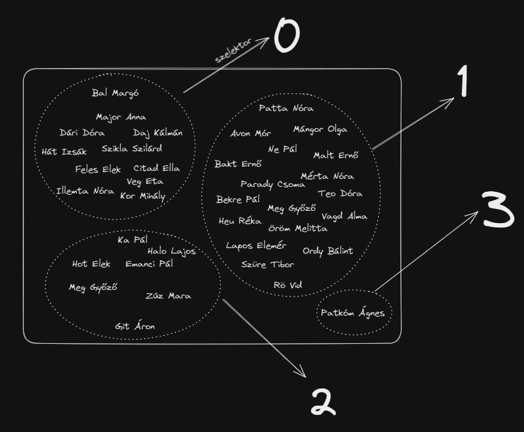

# DQL: Data Query Language
## Tartalomjegyzék
- [Alapok](#alapok)
- [Egytáblás lekérdezések](#egytáblás-lekérdezések)
    - [J - példa-adatbázis szerkezete](#j-példa-adatbázis-szerkezete)
    - [SELECT és FROM](#select-és-from)
        - [FROM](#from)
        - [SELECT](#select)
        - [SELECT mezo](#select-mezo)
        - [SELECT mezo1, mezo2](#select-mezo1-mezo2)
        - [SELECT f(mezo)](#select-fmezo)
            - [Függvények szerinti képek](#függvények-szerinti-képek)
            - [Összesítések](#összesítések)
        - [Rekordok szűrése](#rekordok-szűrése-select-tel)
            - [SELECT TOP](#select-top---select-limit)
            - [SELECT DISTINCT](#select-distinct)
    - [WHERE](#where)
        - [WHERE ... LIKE ...](#where---like)
    - [GROUP BY](#group-by)
        - [Matek](#matek)
        - [SELECT * ... GROUP BY ...; sosem működik](#select---group-by--sosem-működik)
        - [SELECT X ... GROUP BY X; mindig működik](#select-x--group-by-x-mindig-működik)
        - [GROUP BY + Összesítés](#group-by--összesítés)
        - [GROUP BY mezo1, mezo2](#group-by-mezo1-mezo2)
    - [HAVING](#having)
- [Többtáblás lekérdezések](#többtáblás-lekérdezések)

## Alapok
Egy **elemi lekérdezés** minimális szerkezete a következő:
```sql
SELECT ...
FROM ... ;
```
Maximális szerkezete pedig: 
```sql
SELECT ...
FROM ...
WHERE ...
GROUP BY ...
HAVING ...
ORDER BY ... ;
```

A ``WHERE``, ``GROUP BY``, ``HAVING``, ``ORDER BY`` parancsok tehát nem kötelező összetevői egy DQL utasításnak. Ha viszont előfordulnak, akkor **egymáshoz viszonyított sorrendjük mindig ez kell legyen!**

**Az utasításokat mindig pontosvessző (``;``) zárja.** Egyes adatbáziskezelők (pl. MS Access) kiteszik az elhagyott ``;``-ket a sor végén. 

Az SQL-interpreterek nem érzékenyek arra, hogy ezek a szavak **nagybetűvel legyenek szedve**, de illik erre odafigyelni. (Hajdanán a HTML tag-eket is illett nagybetűvel szedni, de azóta ez a szokás ott már eltűnt.)

**A whitespace-eknek (szóköz, tab, sortörés) jelentősége nincs.** Az értelmező ezeket figyelmen kívül hagyja, az első pontosvesszőig olvas mindent, mielőtt megpróbálja az utasítást végrehajtani.


## Egytáblás lekérdezések
### Tábla importálása: J
A nyers adatok általában txt, tsv vagy csv fájlokban állnak rendelkezésre. Ezeket a különböző adatbáziskezelőkben importálni kell. Accessben egy varázslót kell végigkattintgatni, a többi, szerver-kliens kapcsolatban gondolkodó adatbáziskezelők esetében táblákat és rekordokat létrehozó utasításokban (DDL és DML nyelven) kell gondolkodni.
#### MS Access
> UNDER CONSTRUCTION
#### postgreSQL
> UNDER CONSTRUCTION
#### MySQL
> UNDER CONSTRUCTION
### J: példa-adatbázis szerkezete
A következőkben feltesszük, hogy az olvasó már képes táblát létrehozni (DDL), és rendelkezésre áll a 3000J feladat adatbázisa. Ennek az adatbáziskezelésre átalakított nyers .csv (comma separated value) fájlja itt található meg: [J.csv](J.csv).

A továbbiakban feltesszük, hogy a tábla neve ``J``, a mezők nevei a fájl első sorában lévő értékeknek felelnek meg, azaz: 
- ``id`` (szám): A törzslapszám. *Ez az elsődleges kulcs.*
- ``nev`` (szöveg): A tanuló neve.
- ``matinfo`` (szöveg): A matematika és informatika szerinti csoportbontás.
- ``angol`` (szöveg): Az angolcsoport
- ``nyelv2`` (szöveg): A második nyelv szerinti csoport.
- ``nem`` (logikai): Biológiai nem (a -1 a fiú és a 0 a lány).
- ``egyuttlakok`` (szám): Az együttlakók száma. 
- ``testverek`` (szám): A testvérek száma
- ``szulido`` (dátum): A tanuló születési ideje.
- ``huzottid`` (szám): A karácsonyi húzás során húzott tanuló törzslapszáma. *(Idegen kulcs.)*


### ``SELECT`` és ``FROM``
#### ``FROM``
A következőkben végig egytáblás lekérdésekkel, a ``J`` táblával dolgozunk, így a legtöbb lekérdezésünk mindig ezt fogja tartalmazni: ``FROM J``. A ``FROM`` klauzulának főleg a többtáblás lekérdezések esetében és a lekérdezések egymásba ágyazása során van szerepe, így ezt most egyelőre nem tárgyaljuk mélyebben. 
#### ``SELECT``
A legalapvetőbb lekérdezés, ami minden más lekérdezés kiindulópontjaként is szolgál, a következő: 
```sql
SELECT *
FROM J;
```
Ez a lekérdezés nem csinál mást, mint visszaadja az eredeti táblát. 

A **SELECT** után következő rész arra szolgál, hogy megmondjuk, **a tábla mely oszlopaival mi történjen**. 

A ``*`` azt jelenti, hogy jelenjen meg mindegyik. 

Jótanács: A feladatok megoldása során ameddig csak lehet, érdemes a ``*``-ot szerepeltetni, és csak akkor eltünteni, amikor már nem lehet enélkül továbbfejleszteni az sql-kódot vagy ez hiányzik már csak a helyes megoldáshoz. 

#### ``Select mezo``
A ``Select`` alkalmas arra, hogy a táblából elhagyjunk sorokat. Ilyenkor a szerepeltetni kívánt oszlopokat felsoroljuk a ``Select`` után. 

A következő lekérdezés előállítja az osztálynévsort:
```sql
SELECT nev
FROM J;
```
Ennek eredménye:

```...```

#### ``SELECT mezo1, mezo2``
Vesszővel elválasztva több oszlopot is meg lehet adni. Ilyenkor a megadott sorrendben sorolja fel az oszlopokat.
```sql
SELECT nev, szulev
FROM J;
```
#### ``SELECT f(mezo)``
##### Függvények szerinti képek
A ``SELECT`` valójában arra szolgál, hogy az eredeti tábla rekordjain ("sorain") különböző operációkat hajtsunk végre. A fentiek során például projekciókat láthattunk: egy rendezett $n$-eshez hozzárendeltük az egyik tagját, és az eszerinti képek alkotta tábla volt az eredmény. 

De valójában nem csak projekciófüggvények alkalmazhatók: **bármilyen olyan függvényt lehet használni, amely egy adott rekorddal tenne valamit.** Például van egy függvény, amely a dátumhoz hozzárendeli az évszámát mint számot, ez a ``YEAR`` függvény. A következő lekérdezés arra a kérdésre ad választ, hogy mely tanuló melyik évben született:

```sql
SELECT nev, YEAR(datum)
FROM J;
```

A következő pedig azt mutatja meg, hogy melyik tanuló hány olyan rokonnal él együtt, akik nem a testvérei: ugyanis az együttlakók számából kivonva a testvéreket és saját magát az egyéb rokonok száma marad. 

```sql
SELECT nev, egyuttlakok-testverek-1
FROM J;
```


A következő függvények például használhatók hasonló módon arra, hogy egy $n$-rekordból álló táblából egy másik $n$ rekordból álló táblát kapjunk azáltal, hogy a megfelelő mezőkön elvégzett függvények képét vesszük:

- Konkatenáció: ``...&...``
- Összeadás: ``...+...``
- Kivonás: ``...-...``
- Szorzás: ``...*...``
- Osztás: ``.../...``
- Maradékos osztás maradéka: `` ... MOD ...``
- Maradékos osztás eredménye: `` ... DIV ...``
- Felső egészrész: ``CEILING(...)``
- Alsó egészrész: ``FLOOR(...)``
- Kerekítés: ``ROUND(...,...)`` (a második paraméter nem kötelező, a kerekítés mértékét szabályozza.)
- Abszolútérték: ``ABS(...)``
- Alapvető dátum-projekciók: ``YEAR(...)``, ``MONTH(...)``, ``DATE(...)``, ``HOUR(...)``, ``MINUTE(...)``, ``SECOND(...)``

A különböző adatbáziskezelők (MySQL, PostgreSQL, MSSQL, ...) általában nem különböznek nagyon az SQL parancsok értelmezésében. Azonban a fenti függvények pont azon kivételét alkotják a nyelveknek, amelyekben a különböző értelmezők jelentősen eltérhetnek. Ezért érdemes ezeknek néha utánanézni a házi feladatok megoldása közben is. 

##### Összesítések

Összesítésnek nevezzük táblákon értelmezett, rekord értékű függvényeket. Nagyon leegyszerűsítve: Az összesítések olyan függvények, amelyek sok adatból csinálnak egyetlen adatot. 

Példák: 
- ``COUNT``: Az osztályhoz hozzárendeljük az osztálylétszámot. Azaz a J tábla $N$ db rekordjához hozzárendelünk 1 db természetes számot. Tehát itt:

$$ \mathsf{COUNT}:H^N\to \mathbb N$$

```sql
SELECT COUNT(*)
FROM J;
```
Itt ``COUNT(id)``-et is írhattunk volna, ennek nincs jelentősége.

- ``AVG``: Az osztályhoz hozzárendeljük az átlagos testvérszámot. 
Azaz a J tábla $N$ db rekordjához hozzárendelünk 1 db természetes számot. Tehát itt:

$$ \mathsf{AVG}:H^N\to \mathbb R $$

```sql
SELECT AVG(testverszam)
FROM J;
```
Itt most fontos, hogy nem írhatunk csillagot az ``AVG``-be. Az előző példában mindegy volt, hogy a teljes sorokat számolja vagy az ``id``-et, de itt nem mindegy, hogy testvérszámot átlagol-e vagy mást -- a sorok esetében értelmezni sem tudja az összeadás műveletét...

- ``MAX``:Az osztályhoz hozzárendeljük a legidősebb tanuló korát.
Azaz a J tábla $N$ db rekordjához hozzárendelünk 1 db dátumot. Tehát itt:

$$ \mathsf{MAX}:H^N\to \mathbb{D} $$

```sql
SELECT MAX(szulido)
FROM J;
```
- ``SUM``: Az osztályhoz hozzárendeljük az együttlakók számának az összegét: 
Azaz a J tábla $N$ db rekordjához hozzárendelünk 1 db természetes számot. Tehát itt:

$$ \mathsf{SUM}:H^N\to \mathbb{N} $$

```sql
SELECT SUM(egyuttlakok)
FROM J;
```

#### Rekordok szűrése SELECT-tel
##### ``SELECT TOP ... `` / ``SELECT LIMIT ...``


Lehetőség van arra, hogy rekordok mentén is korlátozzuk a táblát, ne csak mezők mentén. A következő lekérdezés csak az első három rekordot mutatja a listában:

```sql
SELECT TOP 3 *
FROM J;
```

Fontos, hogy MSAccessben, ha egy adott mező szerint kérünk három elemet, ahol "holtverseny" fordul elő, akkor mindegyiket megmutatja, akkor is, ha így átlépi a hármat.

##### ``SELECT DISTINCT ... ``
A ``DISTINCT`` parancs hatására az ismétlődő rekordokat eltávolítja. Pl. a következő parancs megmutatja, hogy milyen angolcsoportok vannak egyáltalán: 

```sql
SELECT DISTINCT angol
FROM J;
```
### ``WHERE``
A rekordokat szűrni nem csak a lista elejének kiemelésével vagy az ismétlődések eltüntetésével lehet. **A ``WHERE`` a logikai értékű függvényekkel (predikátumokkal) való szűrésre szolgál.**

**FONTOS**: A WHERE mindig a FROM után helyezkedik el és csak egyetlen WHERE tag lehet egy lekérdezésben!

#### Predikátumok
Közismertebb predikátumok:
| Szimbólum  |   Leírás             |        Példa     |
|------------|----------------------|------------------|
| ... = ...  | azonosság            | nyelv2 = "orosz" |
| ... <> ... | különbözés           | nyelv2 <> "angol"|
| ... < ...  |   kisebb             | egyuttlakok < 3  |
| ... > ...  |   nagyobb            | egyuttlakok > 3  |
| ... <= ... | kisebb vagy egyenlő  | egyuttlakok <= 3 |
| ... >= ... | nagyobb vagy egyenlő | egyuttlakok >= 3 |
| ... BETWEEN ... AND ... | két érték között (zárt intervallum) | egyuttlakok BETWEEN 1 and 3 |


például a következő feltétel kiválogatja a német nyelvet tanulókat:

```sql
SELECT *
FROM J
WHERE nyelv2 = "német";
```

Komplex szűrési feltételek is kifejezhetők a szokásos logikai műveletekkel (NOT, AND, OR). A következő példa azon ``német``-et vagy ``olasz``-t tanuló diákok rekordjait szűri ki, akik nem az ``alfa`` matematikai-informatikai csoportban vannak.

```sql
SELECT *
FROM J
WHERE (nyelv2 = "német" OR nyelv2 = "olasz") AND NOT matinfo = "alfa";
```

#### WHERE ... LIKE ...

Lehetséges ún. *wildcard*-okkal is szűrni. A következő lekérdezés azon rekordokat szűri ki, amelyek angolcsoportjában előfordul a "Kis" kifejezés

```sql
SELECT *
FROM J
WHERE angol LIKE "*Kis*";
```
Itt a ``*Kis*`` egy ún. keresőkifejezés, amelyben *wildcard*-ok segítik a keresést. 

A ``*`` azt jelenti, hogy az adott pozícióban bármilyen hosszú és bármilyen karakterből álló karaktersorozat előfordulhat. Tehát mivel a ``Kis`` szó előtt és után is előfordul a ``*``, így bármilyen olyan karaktersorozatra illeszkedni fog a keresőkifejezés, amely a ``Kis`` karakterhármast tartalmazza. Ez MSAccessre jellemző wildcard, máshol (oleDB, SQLServer) a ``%`` jel a használatos.

A ``?`` jel azt jelenti, hogy az adott pozícióban bármilyen karakter előfordulhat, de csak egyetlen egy karakter. Ez MSAccessre jellemző wildcard, máshol (oleDB, SQLServer) a ``_.`` jel a használatos. Tehát például a ``?. Kis*`` azt jelenti, hogy bármilyen karakterrel kezdődő, ponttal, szóközzel és ``Kis``-sel folytatódó jelsorozat illeszkedőnek számít. A ``LIKE`` függvény pedig pontosan azon rekordokra ad majd igazat, amelyeknél a wildcard illeszkedik a megadott mezőre.

| Szimbólum | Leírás | Példa|
|-----------|--------|------|
|\*| 0 vagy több tetszőleges karakter| "bl\*"-ra illeszkednek: "black", "blue", "blob"|
|?|Egyetlen tetszőleges karakter|	"h?t"-re illeszkednek: "hot", "hat", "hit"|
|[...]| Egyetlen karakter, ami bármi lehet a keretes zárójelek között. | "h[oa]t"-re illeszkedik "hot" és "hat" de "hit" nem.
|[!...]| Egyetlen karakter, ami bármi lehet, kivéve zárójelben szereplők. |"h[!oa]t"-ra illeszkedik "hit" de "hot" és "hat" nem.|
|[...-...] | Bármilyen karakter a megadott intervallumban| "[a-g]"-re illeszkedik "hat", "hit" de "hot" nem
|#| Egyetlen számjel. De csak számjel.| "2#5"-re illeszkedik bármelyik 2-vel kezdődő és 5-re végző háromjegyű szám

Megjegyzés: SQLServer-en, OLEDB-n stb. ezek a jelek mások!

### ``GROUP BY``

#### Matek

A csoportosítás programozási tétel során egy csoportosítási szempont alapján a $H$ alaphalmazt
- kölcsönösen kizáró *(mutually exlusive)* és
- együttesen kimerítő *(collectively exhaustive)*
halmazokra bontjuk. 

Ezt a matematikában egyébként *partíciónak* hívják. 

**Definíció** *(Partíció.)* Egy $P$ halmazt a $H$ partíciójának nevezünk, amennyiben 
- $P$ minden eleme $H$-nak részhalmaza.
- bármely két halmaz metszete üres (azaz diszjunktak)
- az összes halmaz uniója visszaadja az eredeti halmazt.

$$\mathrm{particio}(P,H) \overset{\mathrm{def}}\iff P\subseteq \mathcal P(H) \land (\forall A,B\in P) (A\cap B = \varnothing) \land \bigcup P = H$$

A csoportosítás szempontját egy ún. *szelektorral* szokás megadni. A szelektor egy hagyományos, a H-n értelmezett függvény. Az alapján kerülnek azonos csoportba elemek, hogy a szelektor hozzájuk ugyanazt az értéket rendeli!

A következő ábrán az látható, hogy J halmaz minden rekordjához hozzárendeljük a testvérek számát: 

*(A rekordok esetében most csak a nevet szerepeltettük, de azok rendezett n-esek! A szelektor pedig egy projekció, amely minden rekordhoz hozzárendeli a testvér mezőjét! A csoportok tehát nem mások, mint a szelektor szerinti inverz képek!)*



#### ``SELECT * ... GROUP BY ...;`` sosem működik!
Nagyon fontos, hogy a táblák táblázatokként való megjelenítésekor a csoportosítás eredményével nem lehet mit kezdezni, ugyanis ezek halmazok, nem pedig rekordok!

Ez az SQL-lekérdezés tehát **NEM FOG MŰKÖDNI**, mert a csoportosítás bár elkészülhetne, de nem tudja megjeleníteni:

```sql
SELECT ???
FROM J
GROUP BY testverek;
```

Ezek a halmazok csak akkor férnek be egyetlen rekordba, ha valamilyen összesítő függvénnyel tömörítjük őket.

#### ``SELECT X ... GROUP BY X;`` mindig működik!
A következő megoldás mindig működik: A csoportokat magukat nem, de a csoportok "címkéjét", azaz az azonos csoportba való tartozásért felelős szelektorértéket megmutatja. 

```sql
SELECT testverek
FROM J
GROUP BY testverek;
```

**Megjegyzés.** Vegyük észre, hogy ha onnan nézzük, hogy ez a 
```sql
SELECT testverek
FROM J;
```
lekérdezés kibővítése, akkor a ``GROUP BY`` innen nézve csak ugyanazt csinálja, mint a ``DISTINCT``: eltünteti az ismétlődéseket. Van, aki ezt használja az ismétlődések eltüntetésére is. 

#### ``GROUP BY`` + Összesítés

A következő lekérdezés már összesítő függvénnyel tömörít: megmondja, hogy melyik testvérszámmal hány tanuló bír:

```sql
SELECT testverek, Count(*)
FROM J
GROUP BY testverek;
```
Vegyük tehát észre, hogy csoportosító lekérdezéseknél a SELECT-ben lévő összesítő függvények a csoportokra hatnak, nem pedig az eredeti halmazra!

**JÓ TANÁCS**. A csoportosítási lépés egy olyan lépés, ahol a *-ot már nem lehet a SELECT után már nincs értelme szerepeltetni, ezekre az interpreterek hibaüzenetet fognak adni. Ilyenkor a csoportosítás szempontját (a szelektort) érdemes szerepeltetni helyettük, hogy lefusson a kód.

### GROUP BY mezo1, mezo2
> UNDER CONSTRUCTION

> Ide kéne egy jó excalidrawos kép arról, hogy két partíció hogyan generál egy harmadikat!

### ``HAVING``

A ``WHERE`` mindössze csak egyszer szerepelhet egy lekérdezésben. Ha ``GROUP BY``-jal együtt szerepel egy lekérdezésben, akkor az azt jelenti, hogy a **csoportosítás előtt történik** az elemek kiválogatása. 

Ha valaki mégis a csoportosítás után szeretne szűrni (pl. csak a legalább ötfős csoportokat szeretné megtartani), akkor erre a ``WHERE`` nem lesz alkalmas. Erre találták ki a ``HAVING``-et.

A következő lekérdezés kiválogatja a legalább 5 fős csoportokat:

```sql
SELECT testverszam, COUNT(*)
FROM J
GROUP BY testverszam
HAVING 5 <= COUNT(*);
```

Minden egyébben a HAVING ugyanúgy működik, mint a WHERE. 

Tehát a kettő közötti különbség:

- A ``WHERE`` a csoportosítás **előtt** szűr.
- A ``HAVING`` a csoportosítás **után** szűr.


### ORDER BY

Az ``ORDER BY`` arra szolgál, hogy sorbarendezze a listát egy adott szempont szerint. A szempontot megintcsak egy szelektorral, azaz egy rekordokon értelmezett függvénnyel biztosítjuk.

Elsősorban projekciófüggvényeket használunk, azaz pl. a következő lekérdezés az osztályt születési idejük szerint rakja sorba:

```sql
SELECT nev, szulido
FROM J
ORDER BY szulido;
```

használhatunk azonban egyéb szempontokat is, például ha egy olyan listát akarunk készíteni, ahol a diákok aszerint vannak sorba rakva, hogy a születésnapjaik hogyan követik egymást január 1-jétől kezdve, akkor ezt így tudjuk lekérdezni:

```sql
SELECT nev, szulido
FROM J
ORDER BY MONTH(szulido), DAY(szulido);
```

*(Ez más eredményt ad, mint az előző! Például egy 2005.12.31. később lesz, mint 2006.01.01, pedig korábbi a dátum!)*

Ez utóbbi egyben példa arra is, hogy hogyan lehet elsődleges, másodlagos stb. szempontok alapján is sorbarendezni: vesszővel kell elválasztani a szempontokat. 


#### ORDER BY ... ASC/DESC
A sorbarendezés alapértelmezés szerint mindig növekvő, (szövegek esetén hagyományos ábécé-sorrend).

Ha mégis fordított sorrendben szeretnénk rendezni, akkor azt a ``DESC`` kiegészítéssel lehet elérni:

```sql
SELECT nev, szulido
FROM J
ORDER BY szulido DESC;
```

Létezik az ``ASC`` kiegészítés is, ami a növekvő sorrendet jelenti. Ezt akkor használjuk, amikor egymást követő rendezési szempontok során akarjuk explicitté tenni, hogy melyik szempont növekvő, csökkenő...

```sql
SELECT nev, egyuttlakok, testverszam
FROM J
ORDER BY egyuttlakok DESC, szulido ASC, nev ASC;
```

## Lekérdezések beágyazásai
FROM után mindig be lehet ágyazni. 
```sql
SELECT ...
FROM (SELECT ...);
```
> **VIGYÁZAT**: pontosvessző csak a legvégén legyen, a beágyazott lekérdezésben ne!

### Halmazműveletek
#### ``IN``: beágyazás szűrésbe
```sql
SELECT ...
FROM ...
WHERE ... IN (SELECT ...);
```
> UNDER CONSTRUCTION
#### ``UNION``

$$ A\cup B \overset{\mathrm{def}}{\iff} \{ x: x\in A \lor x\in B \} $$

*(naiv definíció)*
```sql
SELECT ...

UNION

SELECT ...;
```

#### Metszet

$$ A\cap B \overset{\mathrm{def}}{\iff} \{ x\in A :  x\in B \} $$

```sql
SELECT X
FROM A
WHERE X IN B;
```
> UNDER CONSTRUCTION
#### Különbség

$$ A\setminus B \overset{\mathrm{def}}{\iff} \{ x\in A :  x\notin B \} $$


```sql
SELECT X
FROM A
WHERE X NOT IN B;
```
> UNDER CONSTRUCTION

## Többtáblás lekérdezések
> UNDER CONSTRUCTION
### Direkt szorzat
> UNDER CONSTRUCTION
### Relációk és definíciók
> UNDER CONSTRUCTION

A karácsonyi húzás során...
1. ... van-e bárki, aki saját magát húzta?
2. ... van-e két olyan tanuló, akik egymást húzták?
3. ... van-e három olyan tanuló, akik körbe húzták egymást?
4. ... igaz-e, hogy helyes *(bijektív)* a húzás, azaz 
    1. Mindenkit húzott valaki? *(szürjektív)*
    2. Nincs két olyan ember, aki ugyanazt húzta? *(injektív)*
### Táblák összekötése 
> UNDER CONSTRUCTION
#### direkt szorzat szűrésével
> UNDER CONSTRUCTION
#### ``.. INNER JOIN .. ON .. ``
> UNDER CONSTRUCTION
