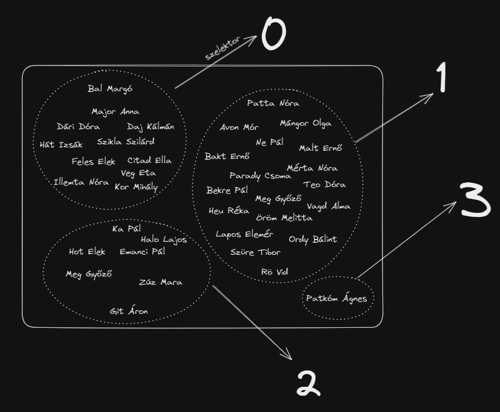
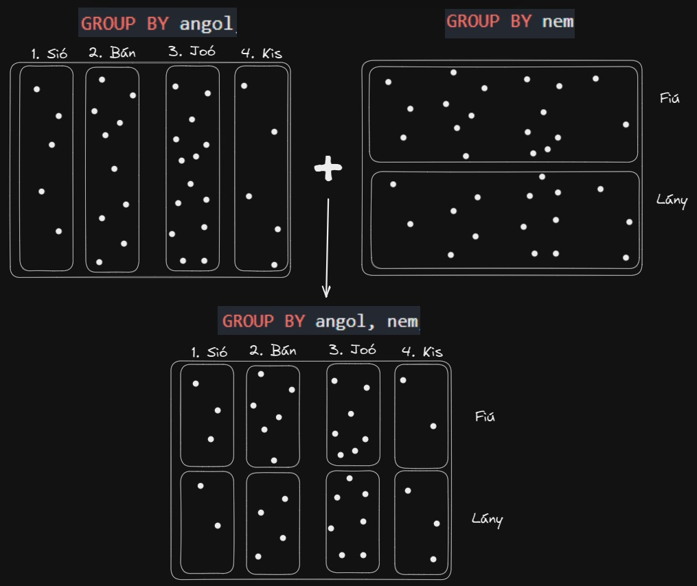

# Tartalomjegyzék
- [Matek](#matek)
- [SELECT * ... GROUP BY ...; sosem működik](#select---group-by--sosem-működik)
- [SELECT X FROM ... GROUP BY X; mindig működik](#select-x-from--group-by-x-mindig-működik)
- [GROUP BY + Összesítés](#group-by--összesítés)
- [GROUP BY mezo1, mezo2](#group-by-mezo1-mezo2)

# ``GROUP BY``
## Matek
A csoportosítás programozási tétel során egy csoportosítási szempont alapján a $H$ alaphalmazt
- kölcsönösen kizáró *(mutually exlusive)* és
- együttesen kimerítő *(collectively exhaustive)*
halmazokra bontjuk. 

Ezt a matematikában egyébként *partíciónak* hívják. 

**Definíció** *(Partíció.)* Egy $P$ halmazt a $H$ partíciójának nevezünk, amennyiben 
- $P$ minden eleme $H$-nak részhalmaza.
- bármely két halmaz metszete üres (azaz diszjunktak)
- az összes halmaz uniója visszaadja az eredeti halmazt.

$$\mathrm{particio}(P,H) \overset{\mathrm{def}}\iff P\subseteq \mathcal P(H) \land (\forall A,B\in P) (A\cap B = \varnothing) \land \bigcup P = H$$

A csoportosítás szempontját egy ún. *szelektorral* szokás megadni. A szelektor egy hagyományos, a H-n értelmezett függvény. Az alapján kerülnek azonos csoportba elemek, hogy a szelektor hozzájuk ugyanazt az értéket rendeli!

A következő ábrán az látható, hogy J halmaz minden rekordjához hozzárendeljük a testvérek számát: 

*(A rekordok esetében most csak a nevet szerepeltettük, de azok rendezett n-esek! A szelektor pedig egy projekció, amely minden rekordhoz hozzárendeli a testvér mezőjét! A csoportok tehát nem mások, mint a szelektor szerinti inverz képek!)*



## ``SELECT * ... GROUP BY ...;`` sosem működik!
Nagyon fontos, hogy a táblák táblázatokként való megjelenítésekor a csoportosítás eredményével nem lehet mit kezdezni, ugyanis ezek halmazok, nem pedig rekordok!

Ez az SQL-lekérdezés tehát **NEM FOG MŰKÖDNI**, mert a csoportosítás bár elkészülhetne, de nem tudja megjeleníteni:

```sql
SELECT ???
FROM J
GROUP BY testverek;
```

Ezek a halmazok csak akkor férnek be egyetlen rekordba, ha valamilyen összesítő függvénnyel tömörítjük őket.

## ``SELECT X FROM ... GROUP BY X;`` mindig működik!
A következő megoldás mindig működik: A csoportokat magukat nem, de a csoportok "címkéjét", azaz az azonos csoportba való tartozásért felelős szelektorértéket megmutatja. 

```sql
SELECT testverek
FROM J
GROUP BY testverek;
```

**Megjegyzés.** Vegyük észre, hogy ha onnan nézzük, hogy ez a 
```sql
SELECT testverek
FROM J;
```
lekérdezés kibővítése, akkor a ``GROUP BY`` innen nézve csak ugyanazt csinálja, mint a ``DISTINCT``: eltünteti az ismétlődéseket. Van, aki ezt használja az ismétlődések eltüntetésére is. 

## ``GROUP BY`` + Összesítés

A következő lekérdezés már összesítő függvénnyel tömörít: megmondja, hogy melyik testvérszámmal hány tanuló bír:

```sql
SELECT testverek, Count(*)
FROM J
GROUP BY testverek;
```
Vegyük tehát észre, hogy csoportosító lekérdezéseknél a SELECT-ben lévő összesítő függvények a csoportokra hatnak, nem pedig az eredeti halmazra!

**JÓ TANÁCS**. A csoportosítási lépés egy olyan lépés, ahol a *-ot már nem lehet a SELECT után már nincs értelme szerepeltetni, ezekre az interpreterek hibaüzenetet fognak adni. Ilyenkor a csoportosítás szempontját (a szelektort) érdemes szerepeltetni helyettük, hogy lefusson a kód.

## GROUP BY mezo1, mezo2
Két csoportosítási szemponttal is lehet csoportosítani. 
Lehetséges több szempont alapján is csoportosítani. 
Például a következő csoportosítás megmondja, hogy melyik angolcsoportba hány fiú és hány lány jár:
```sql
SELECT angol, nem, COUNT(*)
FROM J
GROUP BY angol, nem;
```

### Matek
Ilyenkor adott két $f_1$ és $f_2$ szelektor, és ebből készít egy $F$ szelektorfüggvényt, ami minden $x$ rekordhoz immár egy rendezett párt rendel:

$$F(x) = (f_1(x),f_2(x)).$$ 
 
Ez alapján azon elemek tartoznak majd ugyanabba a halmazba, amelyekhez ugyanaz a rendezett pár van rendelve.

Rajzban elég beszédesen ábrázolható a szituáció: 



## GROUP BY [SZÁM]
Lehetséges a csoportosítási szempontot számmal is megadni. Ez ilyenkor azt jelenti, hogy a Select után felsorolt mezők/terminusok közül hanyadikat vegye a csoportosítási szempontnak. Ez akkor hasznos, amikor komplex függvények ezek a terminusok és nem akarunk sokat írni. Érettségik megoldókulcsaiban lehet gyakran ilyenekkel találkozni. 
