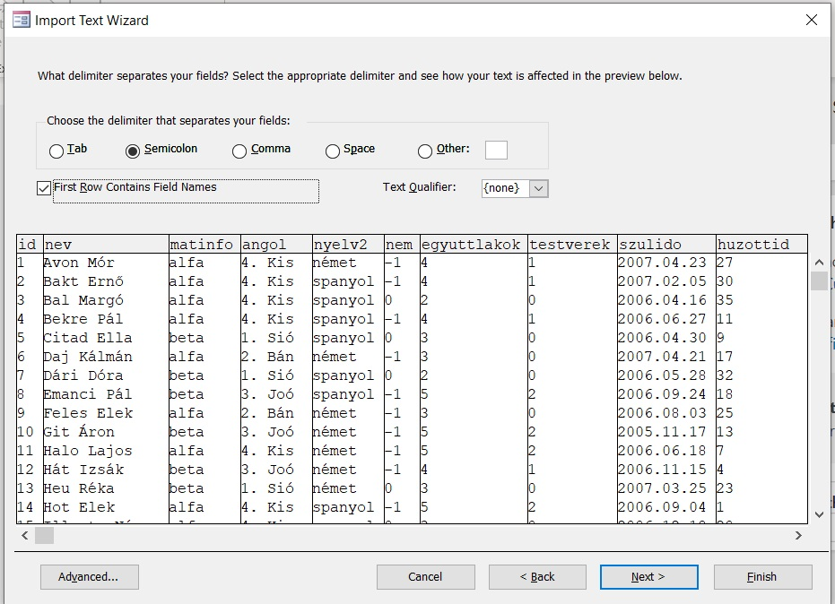

# Szövegfájl importálása (Access 2016)
A következőkben angol nyelvű Access-en készült képeket fogok használni:

1. Varázsló elindítása:

2. Fájl kiválasztása: Az alapértelmezett választáson általában nem kell változtatni

3. Először mindig egy katyvasz fogad minket: ékezetekre kell ilyenkor első sorban odafigyelni. 

4. A lenti Advanced/Speciális gombra kell kattintani, hogy feljöjjön ez:

5. A kódolást UTF-8-ra állítjuk

6. Az adatbázisban nálunk ``YYYY.MM.DD`` formátumban vannak a születési idők, így át kell állítani az importnál is, hogy így értelmezze a dátumokat. Ebben az esetben három helyen kell változtatni:

- YMD-re kell a sorrendet átírni
- a dátumelválasztó jelet .-ra kell áríni
- a sorvezető nullákat be kell állítani
- (A 4számjegyű év eleve be volt kapcsolva)
- (óra-perc-másodperc pedig ez alkalommal nem volt)

7. Ha ez megvan, bezárhatjuk az ablakot és mehet a következő lépés: a tagolás kapcsán a delimiter-opció legyen kiválasztva, mivel a csv fájlunk ``;``-vel tagol mindent. Tehát pontosan úgy, ahogy az eredetileg alapértelmezettként is be volt állítva a fenti képen.
8. Ha nem észlelte volna magától, állítsuk be, hogy pontosvessző a tagolójel. Kattintsuk be azt is, hogy az első sor tartalmazza a mezőneveket. (Ez nem mindig van így, de az érettségi feladatokban általában így van.)

Mehet a tovább.
9. A most következő rész az, hogy a mezőket beállíthatjuk. Látszólag jól értelmezte alapból, de két helyen mindig oda kell figyelni ilyenkor:
- Ha vannak logikai értékek, akkor azokat általában nem veszi észre. Az Access általában ilyenkor a -1-et érzékeli igaznak és a 0-át hamisnak, mert így is tárolja őket.

*(Emlékezzünk vissza arra, hogy fixpontos számábrázolás során a 0 a csupa nulla bit, a -1 pedig az a byte, amihez hozzádva egyet 0-át kapunk, azaz a túlcsordulás jelensége miatt a csupa 1-es bitet tartalmazó byte.)*
- Ha vannak dátumok, akkor azokat általában nem észleli magától. Itt sem érzékelte jól.

Nyomjunk a továbbra.
10. A következő lépés a kulcsok beállítása. Három opció van: 
    1. alapértelmezett: új kulcs hozzáadása (nekünk már van, a torzslapszámot adó ``id`` pont ez, így nem élünk ezzel.)
    2. egy mező kiválasztása, ahol tudjuk, hogy minden adat egyedi a táblán belül
    3. lépés kihagyása. Mivel minden rendes táblának kell legyen kulcsa, ehhez csak akkor folyamodunk, ha összetett kulcsot tervezünk beállítani később.

nyomjunk a továbbra, miután kiválasztottuk a másodikat. 
11. Tábla nevének megválasztása

- az érettségi feladatokban mindig kisbetűsek a nevek!
- Többtáblás adatbázisok során érdemes rövid, beszédes neveket választani!
- ne használjunk ékezeteket!